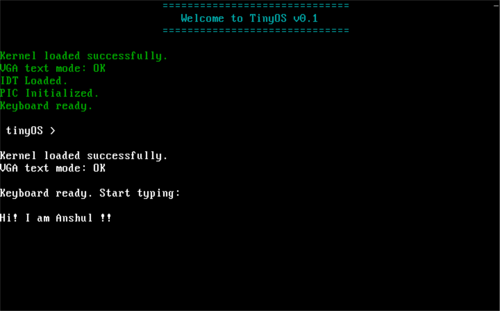

# TinyOS

<p align="center">
  
</p>

<p align="center">
  A simple 32-bit x86 operating system kernel built from scratch.
</p>

Currently, TinyOS can:

- Boot using GRUB (Multiboot)
- Enter protected mode through GRUB
- Load a custom kernel
- Write directly to VGA text-mode memory
- Display text on the screen
- Build into a bootable ISO image
- Run inside QEMU

---

## Demo

```text
--------------------------------
Welcome to TinyOS v0.1
--------------------------------

Kernel loaded successfully.
VGA text mode: OK
```

---

## Project Structure

```text
TinyOS/
├── assets/
├── boot/
│   ├── boot.asm
│   └── idt_asm.asm
├── include/
│   └── types.h
├── kernel/
│   ├── kernel.c
│   ├── idt/
│   │   ├── idt.c
│   │   └── idt.h
│   ├── keyboard/
│   │   ├── keyboard.c
│   │   └── keyboard.h
│   ├── pic/
│   │   ├── pic.c
│   │   └── pic.h
│   ├── ports/
│   │   └── ports.h
│   └── vga/
│       ├── vga.c
│       └── vga.h
├── grub.cfg
├── linker.ld
├── Makefile
└── README.md
```

---

## Build Requirements

- GCC (32-bit support)
- NASM
- GNU LD
- GRUB tools
- QEMU

Ubuntu:

```bash
sudo apt update

sudo apt install \
build-essential \
nasm \
grub-pc-bin \
xorriso \
qemu-system-x86
```

---

## Build

```bash
make
```

This generates:

```text
kernel.elf
tinyos.iso
```

---

## Run

```bash
make run
```

---

## Clean

```bash
make clean
```

---

## Current Features

- [x] GRUB Multiboot support
- [x] Custom linker script
- [x] VGA text output
- [x] Bootable ISO generation
- [x] QEMU support
- [x] Keyboard driver
- [x] Interrupt handling (IDT)
---

## Planned Features
- [ ] Memory management
- [ ] Heap allocator
- [ ] Shell
- [ ] Filesystem
- [ ] Multitasking

---

## Learning Goals

This project exists primarily to explore:

- Computer Architecture
- Operating Systems
- x86 Assembly
- Memory Layout
- Linking and Loading
- Low-level C Programming

---

## License

MIT License
